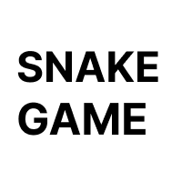

# Snake in Favicon

Play the nostalgic snake game in the favicon of the [website](https://snake.apoorv.page). Use the arrow keys to control the snake in the favicon and reach high scores!

### But Why?

- Why not?
- I wasn't sure if it would work.
- I love working with HTML5 canvas

### How it works?

The implementation is quite simple, most of the time went into actually implementing snake game. I create a canvas element and then you play the game on that canvas. After every move, I convert canvas to PNG Data url and then change the favicon link.

This is build using `vanilla-ts` template from [vitejs](https://vitejs.dev/)

### I found a bug / I want to contribute

Great news! If you found a bug, please open an issue. I would try to resolve it. If you want to contribute, much better, open a PR and I review it and merge!
